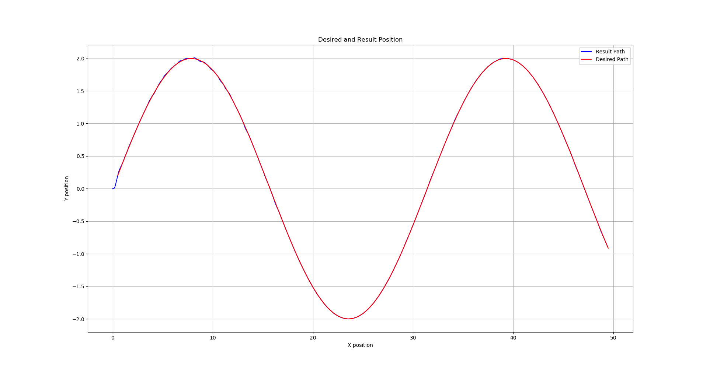
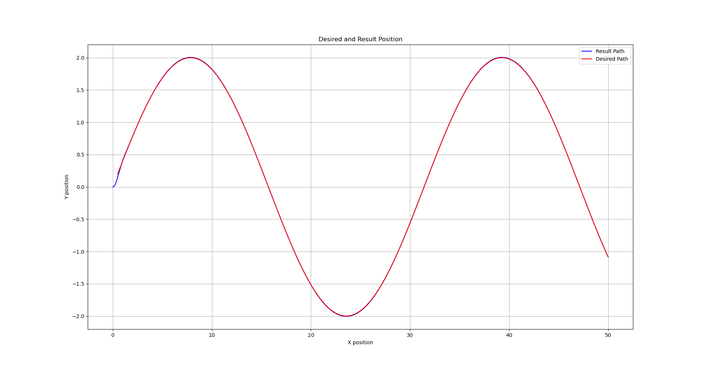
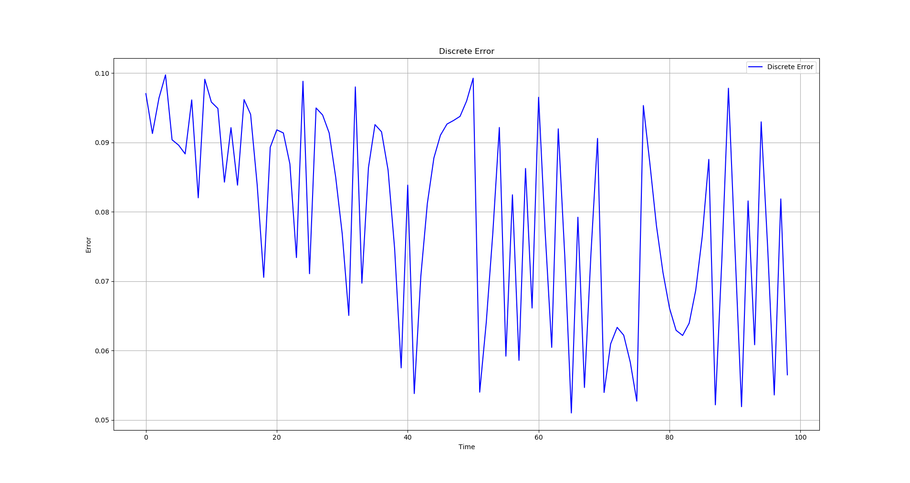
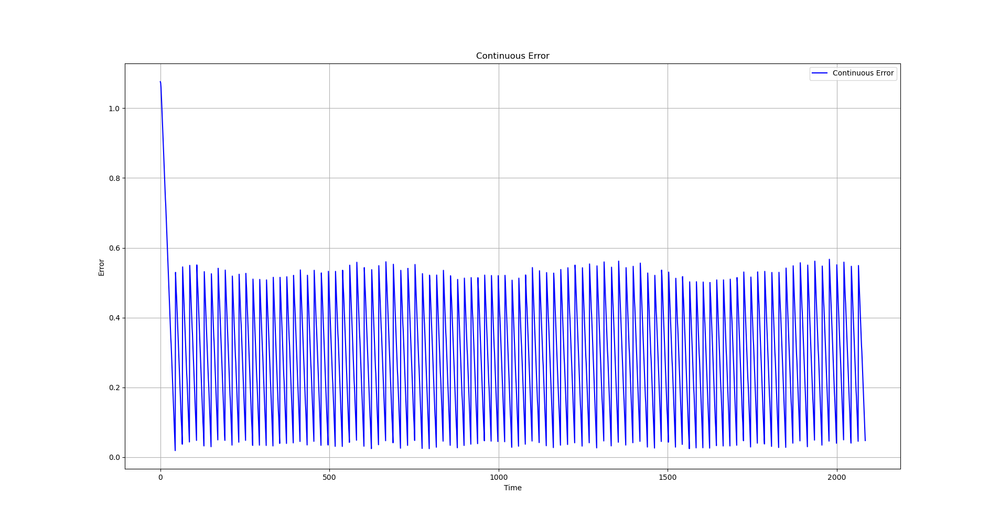

# ROS Controllers
+ [ ]  MPC 
+ [x] PID
+ [x] Pure Pursuit
+ [x] Stanley

**MPC library uses casadi and eigen libraries**

This results are getted via this config;
```yaml
/ros_controllers_node:
  ros__parameters:
    PID:
      linear_velocity:
        Kp: 0.5
        Ki: 0.02
        Kd: 0.0
        error_threshold: 0.1
        signal_limit: 0.5
      angular_velocity:
        Kp: 2.0
        Ki: 0.0
        Kd: 0.0
        error_threshold: 0.1
        signal_limit: 0.52359877559
    Stanley:
      V: 0.25  
      K: 0.8
      error_threshold: 0.05
      signal_limit: 0.52359877559
    PurePursuit:
      lookahead_distance: 0.5
      error_threshold: 0.1
      signal_limit: 0.52359877559
      vehicle_base_width: 0.5
    sleep_time: 100 # miliseconds
    csv_folder_name: "/home/furkan/controller_ws/src/ros_controllers/results/"
```

### PID Result
<p align="center">
  
</p>

### Stanley Result
<p align="center">
  
</p>

### Pure-Pursuit Result
<p align="center">
  
</p>

---

## PID Errors

### Continuous Error for PID
<p align="center">
  
</p>

### Discrete Error for PID
<p align="center">
  
</p>

---

## Stanley Errors

### Continuous Error for Stanley
<p align="center">
  
</p>

### Discrete Error for Stanley
<p align="center">
  
</p>

---

## Pure-Pursuit Errors

### Continuous Errors for Pure-Pursuit
<p align="center">
  
</p>

### Discrete Erros for Pure-Pursuit
<p align="center">
  
</p>


