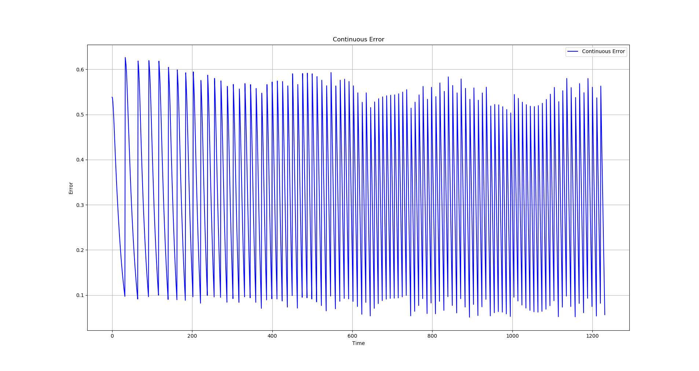
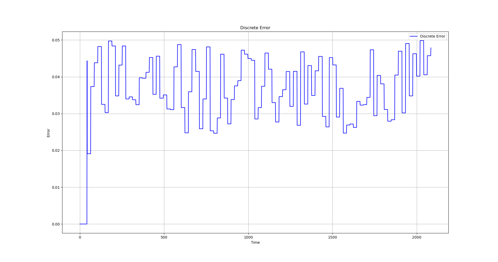

# ROS Controllers
+ [ ]  MPC 
+ [x] PID
+ [x] Pure Pursuit
+ [x] Stanley

### PID Result

  

### Stanley Result

  

### Pure-Pursuit Result

  

---

## PID Errors

### Continuous Error for PID

  

### Discrete Error for PID

  

---

## Stanley Errors

### Continuous Error for Stanley

  

### Discrete Error for Stanley

  

---

## Pure-Pursuit Errors

### Continuous Errors for Pure-Pursuit

  

### Discrete Erros for Pure-Pursuit

  

